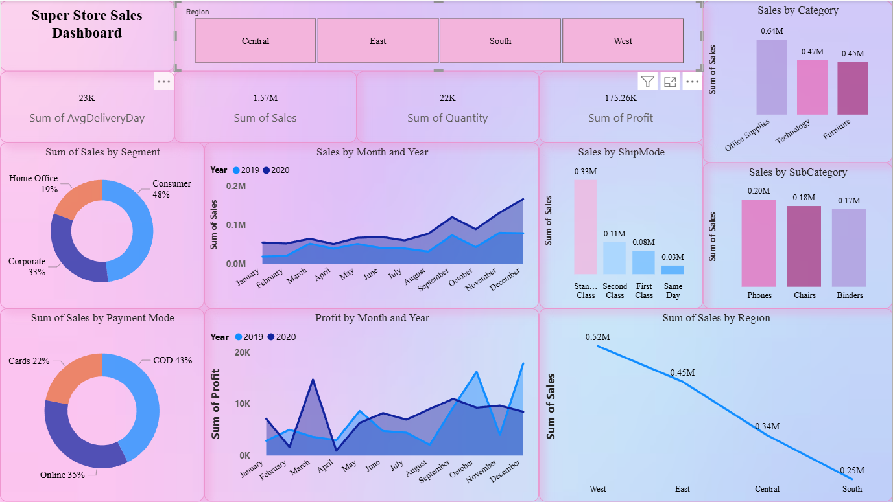
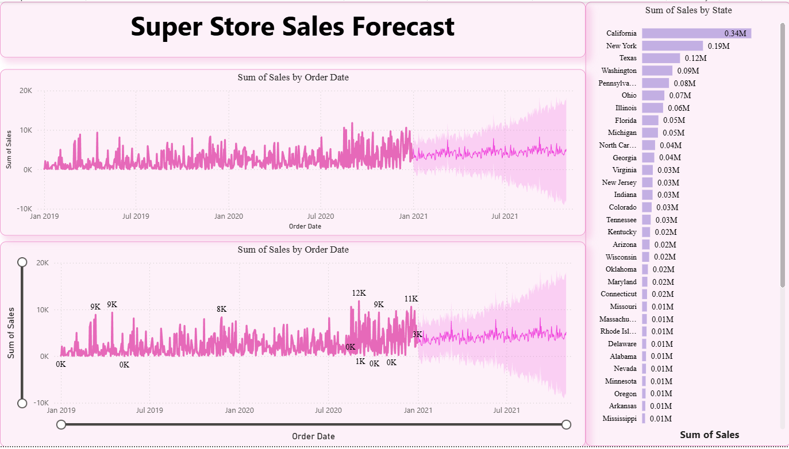

# 🏪 Super Store Sales Dashboard

An interactive **Power BI dashboard** designed to analyze Super Store sales performance across regions, categories, and customer segments.  
This project transforms raw sales data into **actionable insights** through dynamic visuals and key performance indicators.

---

## 📊 Key Highlights

- **Total Sales:** 1.57M  
- **Total Profit:** 175K  
- **Quantity Sold:** 22K  
- **Average Delivery Days:** 23  

### 🔹 Insights at a Glance
- **Consumer Segment** drives the largest share of sales (48%), followed by Corporate and Home Office.  
- **Office Supplies** is the top-selling category, while **Phones**, **Chairs**, and **Binders** lead among sub-categories.  
- **West Region** generates the highest profit.  
- **Sales and Profit Trends** show consistent growth from 2019 to 2020.  
- Analysis of **Payment Modes** and **Ship Modes** helps understand customer preferences and operational performance.  

---

## 🎨 Dashboard Design

The dashboard uses a **gradient-based theme** to create a clean, modern, and visually engaging experience.  
Each chart and KPI card is designed for clarity and storytelling — allowing users to quickly grasp trends and insights.

---

## 🛠️ Tools Used

- **Power BI** – for dashboard design and data visualization  
- **Microsoft Excel** – for data preprocessing and cleaning  
- **Power Query** – for ETL operations and data modeling  

---
## 📸 Dashboard Preview

---
## 💬 About This Project

Created as a part of a personal portfolio project in **Data Analytics and Visualization**.  
The aim is to demonstrate skills in **data storytelling**, **business insight generation**, and **dashboard design**.

Feel free to ⭐ this repo or share your feedback — I’d love to hear your thoughts!

---

### 🔗 Connect with Me
💼 www.linkedin.com/in/binil-john-502a39291 
📧 Contact: biniljohn234@gmail.com
